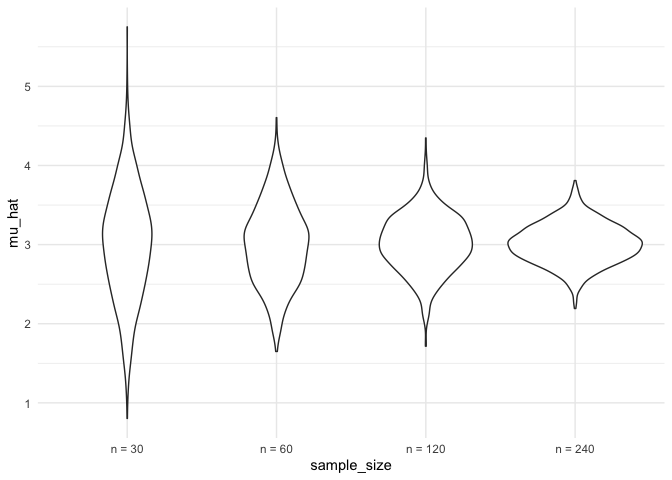

Simulation
================
Ruiqi Yan
11/11/2021

## Let’s simulate something

``` r
sim_mean_sd = function(n, mu = 3, sigma = 4) {
  
  sim_data = tibble(
    x = rnorm(n, mean = mu, sd = sigma),
  )
  
  sim_data %>% 
    summarize(
      mu_hat = mean(x),
      sigma_hat = sd(x)
    )
}
```

I can “simulate” by running this line.

``` r
sim_mean_sd(30)
```

    ## # A tibble: 1 × 2
    ##   mu_hat sigma_hat
    ##    <dbl>     <dbl>
    ## 1   2.98      3.30

## let’s simulate a lot

Let’s start with a for loop

``` r
output <- vector("list", length = 100)

for(i in 1:100){
  
  output[[i]] <- sim_mean_sd(n=30)
  
}

bind_rows(output)
```

    ## # A tibble: 100 × 2
    ##    mu_hat sigma_hat
    ##     <dbl>     <dbl>
    ##  1   3.65      4.25
    ##  2   2.61      3.71
    ##  3   2.78      4.45
    ##  4   1.40      4.15
    ##  5   2.91      4.89
    ##  6   3.09      3.28
    ##  7   4.27      4.26
    ##  8   2.36      4.14
    ##  9   2.73      3.73
    ## 10   3.53      3.81
    ## # … with 90 more rows

Let’s use a loop function

``` r
sim_results <- rerun(100, sim_mean_sd(n = 30)) %>% 
  bind_rows()
```

Let’s look at results…

``` r
sim_results %>% 
  ggplot(aes(x = mu_hat)) +
  geom_density()
```

<!-- -->

``` r
sim_results %>% 
  summarize(
    avg_samp_mean = mean(mu_hat),
    sd_samp_mean = sd(mu_hat)
  )
```

    ## # A tibble: 1 × 2
    ##   avg_samp_mean sd_samp_mean
    ##           <dbl>        <dbl>
    ## 1          3.01        0.755

``` r
sim_results %>% 
  ggplot(aes(x = sigma_hat)) +
  geom_density()
```

<!-- -->

## Let’s try other sample sizes

``` r
n_list <- list(
  "n = 30" = 30,
  "n = 60" = 60,
  "n = 120" = 120,
  "n = 240" = 240
)

output <- vector("list", length = 4)

for(i in 1:4){
  output[[i]] <- rerun(100, sim_mean_sd(n = n_list[[i]])) %>% bind_rows()
}
```

``` r
sim_results <-
  tibble(
  sample_size = c(30, 60, 120, 240),
) %>% 
  mutate(
    output_list = map(.x = sample_size, ~rerun(1000, sim_mean_sd(n = .x))),
    estimate_df = map(output_list, bind_rows)
  ) %>% 
  select(-output_list) %>% 
  unnest(estimate_df)
```

Do some data frame things.

``` r
sim_results %>% 
  mutate(
    sample_size = str_c("n = ", sample_size),
    sample_size = fct_inorder(sample_size)
  ) %>% 
  ggplot(aes(x = sample_size, y = mu_hat)) +
  geom_violin()
```

<!-- -->

``` r
sim_results %>% 
  group_by(sample_size) %>% 
  summarize(
    avg_samp_mean = mean(mu_hat),
    sd_samp_mean = sd(mu_hat)
  )
```

    ## # A tibble: 4 × 3
    ##   sample_size avg_samp_mean sd_samp_mean
    ##         <dbl>         <dbl>        <dbl>
    ## 1          30          3.01        0.705
    ## 2          60          3.01        0.511
    ## 3         120          3.02        0.360
    ## 4         240          3.01        0.252
