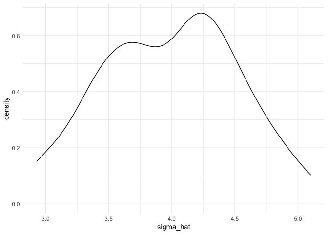

Simulation
================
Ruiqi Yan
11/11/2021

## Let’s simulate something

``` r
sim_mean_sd = function(n, mu = 3, sigma = 4) {
  
  sim_data = tibble(
    x = rnorm(n, mean = mu, sd = sigma),
  )
  
  sim_data %>% 
    summarize(
      mu_hat = mean(x),
      sigma_hat = sd(x)
    )
}
```

I can “simulate” by running this line.

``` r
sim_mean_sd(30)
```

    ## # A tibble: 1 × 2
    ##   mu_hat sigma_hat
    ##    <dbl>     <dbl>
    ## 1   2.95      4.10

## let’s simulate a lot

Let’s start with a for loop

``` r
output <- vector("list", length = 100)

for(i in 1:100){
  
  output[[i]] <- sim_mean_sd(n=30)
  
}

bind_rows(output)
```

    ## # A tibble: 100 × 2
    ##    mu_hat sigma_hat
    ##     <dbl>     <dbl>
    ##  1   3.05      4.49
    ##  2   3.05      3.73
    ##  3   4.24      2.70
    ##  4   4.21      4.14
    ##  5   2.75      3.80
    ##  6   2.66      3.86
    ##  7   3.78      4.23
    ##  8   2.79      4.20
    ##  9   3.81      3.16
    ## 10   2.56      3.39
    ## # … with 90 more rows

Let’s use a loop function

``` r
sim_results <- rerun(100, sim_mean_sd(n = 30)) %>% 
  bind_rows()
```

Let’s look at results…

``` r
sim_results %>% 
  ggplot(aes(x = mu_hat)) +
  geom_density()
```

<!-- -->

``` r
sim_results %>% 
  summarize(
    avg_samp_mean = mean(mu_hat),
    sd_samp_mean = sd(mu_hat)
  )
```

    ## # A tibble: 1 × 2
    ##   avg_samp_mean sd_samp_mean
    ##           <dbl>        <dbl>
    ## 1          2.99        0.650

``` r
sim_results %>% 
  ggplot(aes(x = sigma_hat)) +
  geom_density()
```

<!-- -->

## Let’s try other sample sizes
