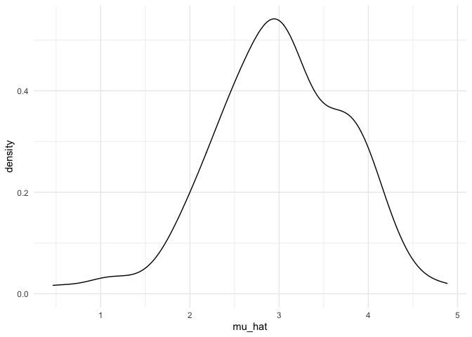

Simulation
================
Ruiqi Yan
11/6/2021

## Let’s simulate something

``` r
sim_mean_sd = function(n, mu = 3, sigma = 4) {
  
  sim_data = tibble(
    x = rnorm(n, mean = mu, sd = sigma),
  )
  
  sim_data %>% 
    summarize(
      mu_hat = mean(x),
      sigma_hat = sd(x)
    )
}
```

I can “simulate” by running this line.

``` r
sim_mean_sd(30)
```

    ## # A tibble: 1 × 2
    ##   mu_hat sigma_hat
    ##    <dbl>     <dbl>
    ## 1   3.96      4.52

## let’s simulate a lot

Let’s start with a for loop

``` r
output <- vector("list", length = 100)

for(i in 1:100){
  
  output[[i]] <- sim_mean_sd(n=30)
  
}

bind_rows(output)
```

    ## # A tibble: 100 × 2
    ##    mu_hat sigma_hat
    ##     <dbl>     <dbl>
    ##  1   2.97      3.39
    ##  2   2.50      4.04
    ##  3   2.79      3.83
    ##  4   2.44      4.29
    ##  5   2.74      4.15
    ##  6   3.04      3.42
    ##  7   3.00      4.56
    ##  8   3.78      4.46
    ##  9   2.43      3.01
    ## 10   3.67      4.41
    ## # … with 90 more rows

Let’s use a loop function

``` r
sim_results <- rerun(100, sim_mean_sd(n = 30)) %>% 
  bind_rows()
```

Let’s look at results…

``` r
sim_results %>% 
  ggplot(aes(x = mu_hat)) +
  geom_density()
```

<!-- -->

``` r
sim_results %>% 
  summarize(
    avg_samp_mean = mean(mu_hat),
    sd_samp_mean = sd(mu_hat)
  )
```

    ## # A tibble: 1 × 2
    ##   avg_samp_mean sd_samp_mean
    ##           <dbl>        <dbl>
    ## 1          2.96        0.741

``` r
sim_results %>% 
  ggplot(aes(x = sigma_hat)) +
  geom_density()
```

<!-- -->
